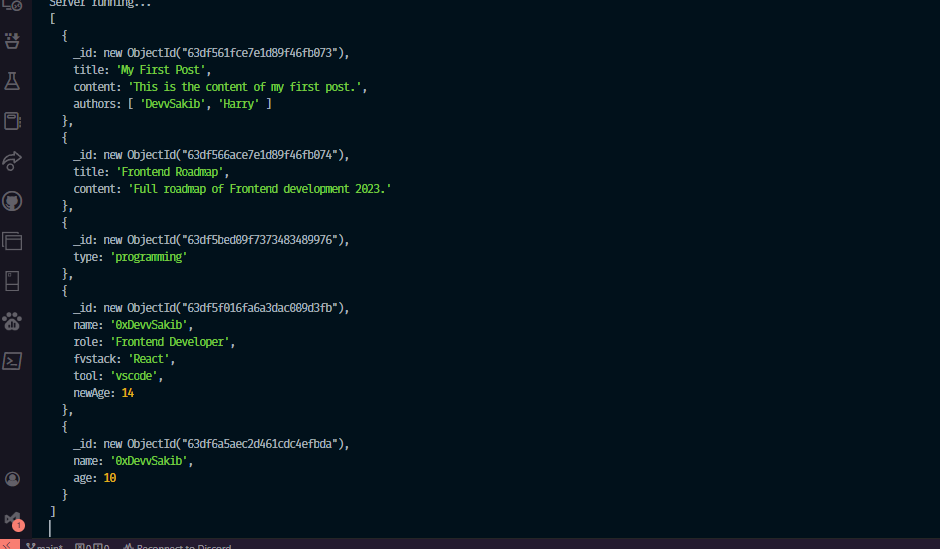
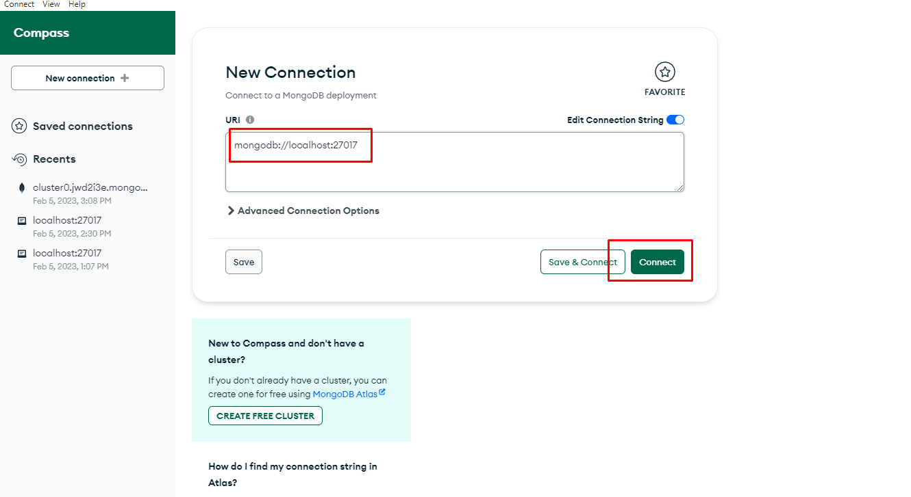

# <p align="center"> Connecting Local MongoDB </p>

# <p align="center">  </p>

## How to connect local MongoDB

1. First copy the connection string from MongoDB Compass



2. Then paste the connection string in the code
```bash
mongodb://localhost:27017/{db name}
```

3. Then write the code to connect mongodb

```js
const mongoseUrl = "mongodb://localhost:27017/{db name}";
mongoose.connect(mongoseUrl, (error, db) => {
    db.collection("{collection name}").find({}).toArray((err, res) => {
        if (err) throw new Error(err);
        console.log(res);
        db.close();
    });
})
```

4. Then run the code

## How to run the code

1. First install the dependencies

```bash
npm install
```

2. Then run the code

```bash
npm run dev
```