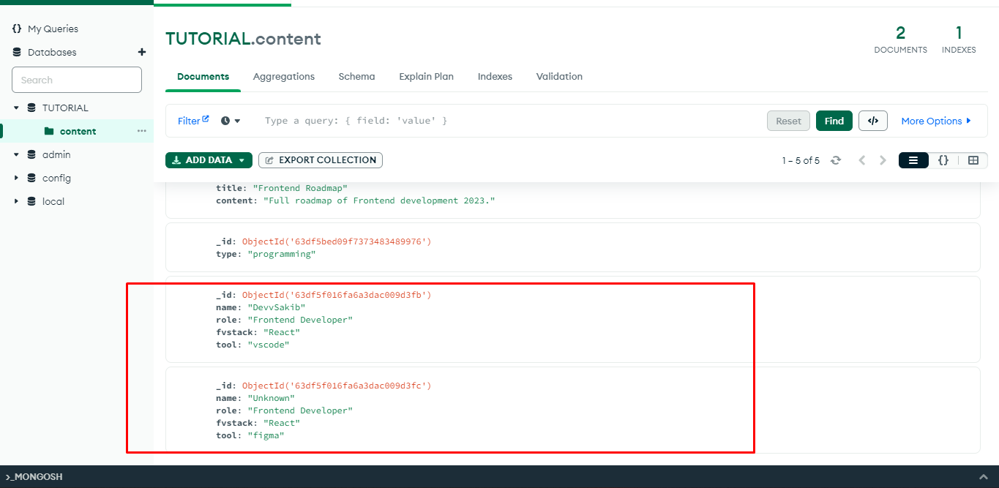
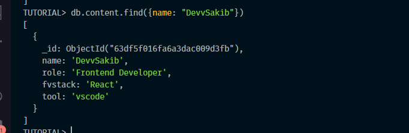
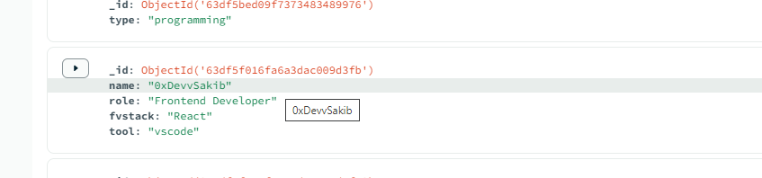

# <p align="center">Cheatsheet for MongoDB</p>


1. Show All DataBase
```shell
show dbs
```

2. Create new/switch DataBase
```shell
use DBNAME
```

3. Show current DataBase
```shell
db
```

4. Delete DataBase
```shell
db.dropDatabase()
```

5. Show DataBase Collection
```shell
show collections
```

6. Create new Collection
```shell
db.createCollection("COLLECTION_NAME")
```

7. Delete Collection
```shell
db.COLLECTION_NAME.drop()
```

8. Insert rows in Collection
```shell
db.COLLECTION_NAME.insert({
    name: "DevvSakib",
    role: "Frontend Developer",
    fvstack: "React",
    tool: "vscode"
})
```

9. Insert multiple rows in Collection
```shell
db.COLLECTION_NAME.insertMany([
    {
    name: "DevvSakib",
    role: "Frontend Developer",
    fvstack: "React",
    tool: "vscode"
},
    {
    name: "Unknown",
    role: "Frontend Developer",
    fvstack: "React",
    tool: "figma"
}
])
```


10. Find all rows in Collection
```shell
db.COLLECTION_NAME.find()
db.COLLECTION_NAME.find().pretty()
```
> pretty()  for better view

11. Find specific rows in Collection
```shell
db.COLLECTION_NAME.find({name: "DevvSakib"})
db.COLLECTION_NAME.find({role: "Frontend Developer", name: "DevvSakib"}) 
```


12. Find rows with limit
```shell
db.COLLECTION_NAME.find().limit(1)
```

13. Count rows in Collection
```shell
db.COLLECTION_NAME.find().count()
db.COLLECTION_NAME.find({name: "DevvSakib"}).count()
```

```shell
db.COLLECTION_NAME.find().sort({name: 1})
db.COLLECTION_NAME.find().sort({id: 1})
```
> 1 for ascending order and -1 for descending order

15. Update row in Collection
```shell
db.COLLECTION_NAME.update({name: "DevvSakib"}, {$set: {name: "0xDevvSakib"}})
```


In case if there are no matching row then it will create a new row if you add upsert: true
```shell
db.content.update({name: "NotInCollection"}, {$set: {name: "0xDevvSakib"}}. {upsert: true})
```
> {name: "NotInCollection"} is the query and {$set: {name: "0xDevvSakib"}} is the update. {upsert: true} is the option. In case query doesn't match any row then it will create a new row.